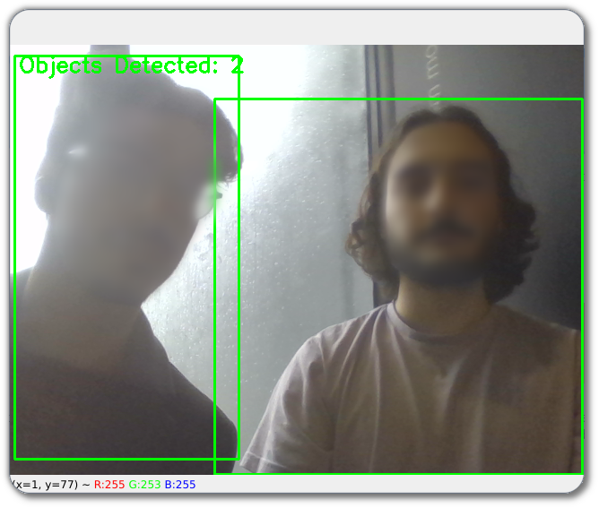

<div align="center">
  
</div>

# Object Detection from Video Stream

  This is a simple client-server application for object detection.
  
  The server receives a video stream from the client through a websocket, processes it using YOLOv3, and returns the number of detected objects and their respective position for each frame.

## Requirements

- Python 3

## Installation

- Clone the repo and install the required Python packages.

  ```bash
  git clone https://github.com/PedroDSFerreira/video-object-detection.git
  cd video-object-detection
  pip install -r requirements.txt
  ```

## Usage

### Server

#### Without Docker

1. Open a terminal and navigate to the server directory.

   ```bash
   cd video-object-detection/server
   ```

2. Download the YOLOv3 model files and place them in the `yolo` directory.

   ```bash
   wget https://pjreddie.com/media/files/yolov3.weights -P yolo
   ```

3. Run the server script.

   ```bash
   python server.py --h <host_ip> --p <host_port> --o <object> --conf <conf_thresh> --nms <nms_thresh>
   ```

- `<host_ip>`: Host ip (default: 127.0.0.1)
- `<host_port>`: Host port (default: 10050)
- `<object>`: Object to detect (default: person)
- `<conf_thresh>`: Confidence threshold (default: 0.6)
- `<nms_thresh>`: [Non-maximum suppression](https://medium.com/@BH_Chinmay/a-deep-dive-into-non-maximum-suppression-nms-understanding-the-math-behind-object-detection-765ff48392e5#:~:text=Non%2Dmaximum%20suppression%20(NMS),correspond%20to%20the%20detected%20objects.) threshold (default: 0.3)

The list of available objects can be found at `server/yolo/coco.names`

The server will start listening for incoming connections on the specified port.

#### With Docker

1. Pull the Docker image.

   ```bash
   docker pull pedrodsf/object-detection-server
   ```

2. Run the Docker container.

   ```bash
   docker run -p <host_port>:8080 pedrodsf/object-detection-server
   ```

### Client

1. Open a terminal and navigate to the client directory.

   ```bash
   cd app-demo/client
   ```

2. Run the client script.

   ```bash
   python client.py --h <host_ip> --p <host_port>
   ```

The client will establish a connection with the server and start sending video frames. The server will process each frame and return the number of detected objects and positions to the client.

## Configuration

- The YOLO model configuration file (`yolov3.cfg`), weights file (`yolov3.weights`), and class names file (`coco.names`) should be placed in the `yolo` directory.

Feel free to experiment with `server/main.py` input parameters to optimize object detection based on your specific use case.

## Dependencies

- YOLOv3 model files: [YOLOv3 Official Website](https://pjreddie.com/darknet/yolo/)
- COCO class names file: [COCO Official Website](https://cocodataset.org/#home)

## License

This project is licensed under the [MIT License](LICENSE).
